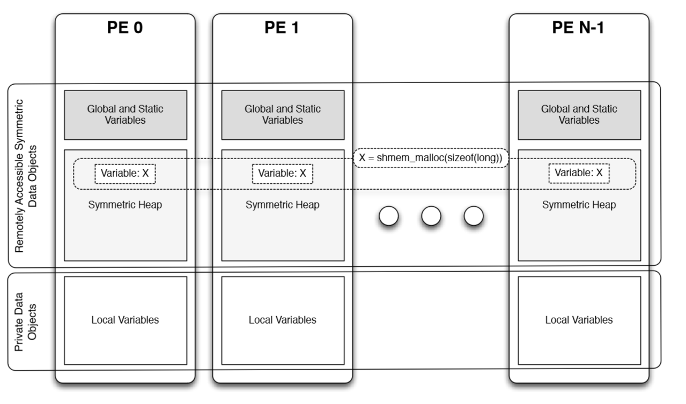

# CSE590 Second Assignment

## Parallel Programming Model in OpenSHMEM
OpenSHMEM provides parallelism by allowing multiple Processing Elements (PEs) to start in parallel and then communicate and synchronize the remotely accessible data objects across PEs. Each PE has remotely accessible, as well as private data objects. Figure below depicts the memory model in OpenSHMEM.

As shown in the above picture, the remotely accessible data consists of:
- Global or static variables
- Data on the symmetric heap (data allocated by shmem_malloc in C and C++)

All other variables are private to the PE they are created in.

Communication and data synchronization between PEs can be done through major memory routines such as:

1. Remote Memory Access (RMA) routines: enable a PE to _put_ some local (private) or public (symmetric) data on a public data object of another PE, or to _get_ some public data from another PE to copy into a local or public data object. Read more about RMA [here](rma.md).
2. Atomic Memory Operations (AMO): enable a PE to atomically fetch and/or update a symmetric data object on a remote PE. Atomically means that while fetching and/or updating the value of remote data, no other PE can access that data. Read more about AMO [here](amo.md).
3. Collective Communication: enable one or multiple PEs to participate in sending, receiving or sharing data, such as _broadcast_, _collection_ or _reduction_.

All data transfers in OpenSHMEM are one-sided (including RMA and AMO), meaning that the PE starting a communication does not wait for the other PE to respond or call a routine to complete the transfer. This allows the overlap of communication and computation since a PE does not wait for other PEs and can continue its work which reduces the runtime due to the reduction of data trasnfer latencies.

## 	Suggested Multi-threading Model for OpenSHMEM
Multi-threading inside a PE allows OpenSHMEM to support nested parallelism. The communications between threads can be independent from the PE beneath or done alongside with the PE's.

### Communication Context
Communication contexts define the set of rules and the way of communication between different PEs, or Remote Memory Access routines, Atomic Memory Operations, and memory ordering routines. Using communication contexts will allow the user to:
- manage the overlap of computations with communications in single-threaded PEs, for example pipelining computations and communications.
- manage the ordering and completion of communications in multi-threaded PEs independently from the PEs (subsystem), for example the isolation of threads from the multi-threaded PE which has created them in order to reduce the overheads of communication between PEs.

### Types of communication contexts
- SHMEM_CTX_DEFAULT: by default, the communication contexts are sharable between the threads of a multi-threaded PE. This means the context can be used concurrently by the threads of a PE.
- SHMEM_CTX_SERIALIZED: available in the multi-threaded model, in this mode the context is not used concurrently by all the threads of a PE. It is up to the user to make sure that operations involved with this mode are serialized.
-	SHMEM_CTX_PRIVATE: available in the multi-threaded and serialized mode, in this mode the context is only usable by the thread that created it. 

#### Resources
- [OpenShmem Application Programming Interface, Version 1.3](http://openshmem.org/site/sites/default/site_files/OpenSHMEM-1.3.pdf)
